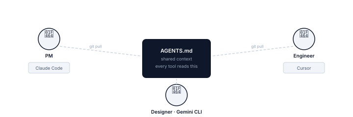

# team-foundry

**Your coding agents know the code. They do not know which customer matters, what the
team decided, or what quality bar applies — so each teammate's AI gives different
answers to the same question. team-foundry turns that missing product context into one
shared, versioned layer that Claude Code, Cursor, Gemini CLI, and Codex all read from
the repo.**

[](https://www.npmjs.com/package/create-team-foundry)
[](https://www.npmjs.com/package/create-team-foundry)
[](LICENSE)



Try a populated fictional team in 10 seconds, without changing your repo:

```bash
npx create-team-foundry playground
```

Or set it up for your own team:

```bash
npx create-team-foundry
```

Local-first and MIT licensed — no backend, no API keys, no telemetry. Each tool's
loading route is verified in the [compatibility matrix](docs/compatibility.md).

## Controlled comparison

On July 2, 2026, two fresh Codex background agents received the **same prompt**, runner
configuration, and Clearline repository snapshot, with no model override. The runner did
not expose the exact model ID. The control could not read team-foundry context; the other
could. We fixed the five-point scoring rubric before running either case.

> **Prompt:** Our deploys are slow. Should we automate database migrations in CI? Give
> a recommendation and implementation constraints.

| Without team-foundry | With team-foundry |
|---|---|
| **"Automate migration validation in CI and execution in the deployment pipeline."** | **"Automate migration validation in CI, but do not automatically execute production migrations yet."** |
| Sensible generic safeguards, but it conflicts with Clearline's existing decision. **Score: 0/5.** | Cited two prior incidents, three prevented near-misses, Marcus and Priya's ownership, customer-trust risk, and the active ADR. **Score: 5/5.** |

In this controlled example, repository context changed the recommendation rather than
merely making it longer. See the [complete first responses, fixed rubric, and reproduction
notes](docs/evidence/f07-controlled-comparison.md), plus the source
[decision](example/team-foundry/engineering/decisions/ADR-005.md).

The same fixture produced this real health report:

```text
team-foundry doctor

Context health: 80/100  Needs attention

  Completeness      30/30   16/16 required files contain real content
  Freshness          0/20    0/16 populated files are current
  Connectedness     25/25    3/3 integrity rule families clean
  Ownership         10/10   16/16 existing files have an owner
  Tool routing      15/15    4/4 pointer files reference AGENTS.md
```

Clearline is a frozen Q2 example, so Doctor correctly flags its April context as stale.
The score was preserved rather than improved by changing dates for the demonstration.

## See the difference in 60 seconds

```bash
npx create-team-foundry playground
```

This creates a populated example team in `team-foundry-playground/`. Open that folder in Claude Code, Cursor, Gemini CLI, Codex, or another tool that reads repository instructions, then ask:

- *"What are we working toward this quarter?"*
- *"Should we prioritize collaborative editing?"*
- *"What architecture decisions have we made and why?"*

Instead of inferring answers from code, the AI can cite the team's outcomes, customers, risks, and decisions. The same example lives in [`example/`](example/) if you would rather browse it.

---

## What gets generated

A real, populated `AGENTS.md` looks like this. Tools that support `AGENTS.md` read it directly; team-foundry generates thin pointer files for tools with their own instruction format.

```markdown
# Agents

## Project overview

**clearline** — Finance teams at mid-market companies close their month-end
without chasing anyone.

## Where to find context

| Topic | Path |
|---|---|
| Vision and north star metric | team-foundry/product/north-star.md |
| This quarter's outcomes      | team-foundry/product/outcomes.md  |
| Who our customers are        | team-foundry/product/customers.md |
| Tech stack and conventions   | team-foundry/engineering/stack.md |
| Architecture decisions       | team-foundry/engineering/decisions/ |
```

…and an outcome it routes to reads like a PM wrote it, not a template:

```markdown
### O1 — AP leads process month-end in under 2 days
Baseline: 4.1 days average (cohort data, Q1 2026). Target: ≤2 days.
Signal: time-to-close in approval routing data, tracked per cohort.
Why it matters: month-end duration is the #1 complaint in NPS verbatims.
```

### Before / after

| | What the AI sees |
|---|---|
| **Before team-foundry** | Each teammate's AI guesses from code + whatever they paste into chat |
| **Right after `npx create-team-foundry`** | `AGENTS.md` with project overview, stack, and owners **auto-detected from your `package.json`, README, and git** — the rest scaffolded as visible gaps to fill |
| **After onboarding** | Outcomes, customers, decisions, and quality bar - selected tools receive the same repo-owned context |

### Who edits what

- **You edit** everything under `team-foundry/` (outcomes, customers, decisions…). These are your team's words.
- **The CLI generates and owns** the pointer files (`CLAUDE.md`, `GEMINI.md`, `.cursor/rules/…`) and the `AGENTS.md` scaffold. Re-running is safe — it merges in place.
- **Keep it honest** with `npx create-team-foundry status` (and `status --ci` in CI).

---

## How it works

One person runs `npx create-team-foundry` in the shared repo. The CLI generates `AGENTS.md`
as the shared routing map plus documented adapters for the selected tools. Commit and push;
teammates receive the same repository-owned context through Git.

No cloud. No sync service. No accounts. Git is the sync.

---

## Supported tools

| Tool | Loading mechanism |
|---|---|
| Codex | Reads `AGENTS.md` natively |
| Claude Code | `CLAUDE.md` imports `@AGENTS.md` |
| Gemini CLI | `GEMINI.md` imports `@./AGENTS.md` |
| Cursor | Root `AGENTS.md` plus an always-applied rule reference |
| GitHub Copilot | Repository instructions ask Copilot to follow `AGENTS.md`; route requires surface-specific verification |
| Other tools | `AGENTS.md` only - confirm support in your tool version |

See the [evidence-labeled compatibility matrix](docs/compatibility.md) for official loading
contracts, exact generated paths, and which tools have been exercised locally.

---

## Commands

| Command | What it does |
|---|---|
| `npx create-team-foundry` | Scaffold context into the current repo (interactive) |
| `npx create-team-foundry adopt` | Import existing `.cursorrules`/`CLAUDE.md`/etc. before scaffolding |
| `npx create-team-foundry playground` | Drop a populated example team into `team-foundry-playground/` |
| `npx create-team-foundry doctor` | Score context health and show the highest-leverage fix |
| `npx create-team-foundry status` | Health table: stale, empty, missing, link-integrity, owners |
| `npx create-team-foundry status --ci` | Same checks, non-interactive, exits 1 on drift (for CI) |
| `npx create-team-foundry init-ci` | Write a GitHub Action that runs the drift gate on every PR |
| `npx create-team-foundry feedback` | Open a prefilled GitHub issue to send feedback |
| `npx create-team-foundry migrate` | Upgrade an existing install to the latest profile |

---

## Learn more

- [How it works](docs/how-it-works.md) — architecture, AGENTS.md primacy, pointer files, detect-and-merge, drift detection
- [Tool compatibility](docs/compatibility.md) — native vs adapter loading, exact output matrix, and verification status
- [Drift gate in CI](docs/ci.md) — `status --ci`, the GitHub Action, and what fails a build
- [The coach](docs/coach.md) — drift detection patterns, trigger phrases, three modes, the flywheel
- [Claude Code skills](docs/skills.md) — six slash commands and their file layout
- [Profiles](docs/profiles.md) — solo, full, federated; file counts and frontmatter
- [Migrating](docs/migrate.md) — upgrade paths from v2 and v3.x to v3.3
- [Getting buy-in](docs/getting-buy-in.md) — handling team objections
- [Changelog](CHANGELOG.md)

---

## Feedback

The most useful question is not "do you like it?" It is: **would you use team-foundry again, and why?**

Run `npx create-team-foundry feedback` to open three short, prefilled questions, or [answer on GitHub](https://github.com/tomershahar/team-foundry/issues/new). Rough notes are more useful than polished praise.

---

## Requirements

Node 18+. Claude Code, Gemini CLI, Cursor, or any AI tool that reads files from your repo.

## Contributing

See [CONTRIBUTING.md](CONTRIBUTING.md).

## License

MIT
