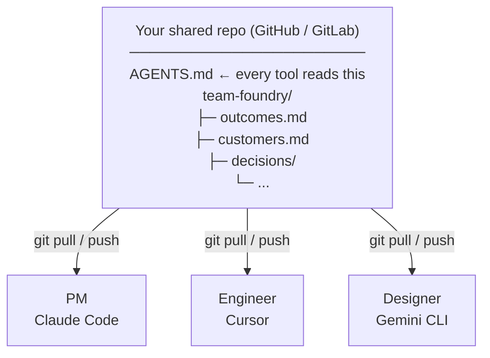

[← Back to README](../README.md)

# How it works

One person runs `npx create-team-foundry` in the shared repo. The CLI generates `AGENTS.md` — the shared context foundation every AI tool reads — plus a thin pointer file for each tool your team uses. Commit and push. Teammates `git pull`. Their AI reads the same files automatically. No cloud, no sync service, no accounts.

If your repo already has `CLAUDE.md`, `AGENTS.md`, or cursor rules, the CLI detects them and asks before changing anything — merge, replace, or skip, per file.

---

## AGENTS.md and the pointer architecture

`AGENTS.md` is the single source of truth: it holds the routing map, team identity, coach instructions, and coding conventions. Tool-specific files (`CLAUDE.md`, `GEMINI.md`, `.cursor/rules/team-foundry.mdc`) are thin pointers that load it.

| Tool | Pointer mechanism |
|---|---|
| Claude Code | `@AGENTS.md` directive — content is injected directly |
| Gemini CLI | `> [!IMPORTANT]` callout instructing Gemini to read `AGENTS.md` at session start |
| Cursor | `.mdc` rule with `alwaysApply: true` and prose instruction |

This means your team context is written once and stays consistent regardless of which AI tool each person uses.

---

## Detect and merge

When the CLI runs in a repo that already has root instruction files, it surfaces each one before writing anything:

```
Found existing CLAUDE.md (42 lines). What should team-foundry do?
> Merge — append team-foundry section, preserve existing content (recommended)
  Replace — back up to .team-foundry/backups/, write fresh
  Skip — leave it alone, scaffold everything else
```

Replaced files are backed up to `.team-foundry/backups/{filename}.{timestamp}.backup` before anything is overwritten.

> **Note:** Merge wraps the new content in `<!-- BEGIN TEAM-FOUNDRY SECTION -->` / `<!-- END TEAM-FOUNDRY SECTION -->` markers, making re-runs idempotent — the section is updated in place rather than appended again.

---

## Git as sync

Updates flow through git. When the coach drafts a fix and you confirm it, it commits normally. Push, pull, review in PRs. No separate sync step.



---

## Pointer drift detection

Over time a pointer file can drift — someone edits `CLAUDE.md` and removes the `AGENTS.md` reference, or the file gets regenerated by another tool. The `status` command checks for this:

```bash
npx create-team-foundry status
```

The output includes a pointer health block:

```
Pointer files (each should reference AGENTS.md):

  ✓  CLAUDE.md                                ok
  ⚠  GEMINI.md                                drifted / out of sync — AGENTS.md reference missing
  ✓  .cursor/rules/team-foundry.mdc           ok
```

> **Warning:** A drifted pointer means that AI tool is no longer loading the shared context. Fix it by running `migrate --to v3.3` or manually restoring the `AGENTS.md` reference in the file.

---

## Status command

```bash
npx create-team-foundry status
```

Full health table across all your files: last updated, days since update, PRs shipped since then, owner, health classification (ok / stale / empty / missing). Link integrity checks flag outcomes with no linked assumption, Now items with no validated bet, and metrics referenced but not defined.
