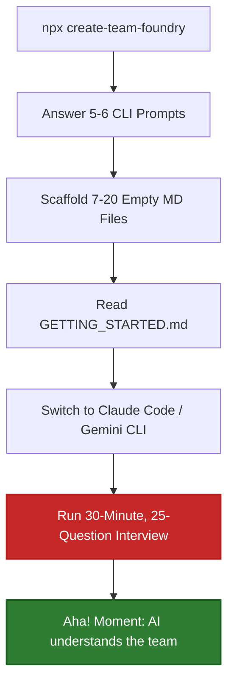

# Product & UX Review: create-team-foundry

Hi Tomer! First of all, **congratulations on 1,100+ npm downloads and your first star!** 

In the open-source CLI world, getting over 1,000 downloads on launch is a **huge milestone**. The fact that you have had no negative feedback, bugs, or complaints actually indicates that the CLI is highly stable, installs successfully across different environments, and doesn't crash. 

However, open source can be a "feedback desert." When things work, developers silently use them and move on. To turn those 1,100 downloads into GitHub stars, active contributions, and raving fans, we need to look at **Value Delivery Speed (Time-to-Aha!)** and **Onboarding Friction**.

Below is a detailed UX and product teardown with actionable recommendations to make `team-foundry` feel like absolute magic.

---

## 1. The Core UX Friction: The "Onboarding Homework"



### The Problem
When a developer runs `npx create-team-foundry`, they answer a few quick questions, and the CLI successfully writes the folder structure. But at this point:
* **The files are empty templates.**
* The user is told to open their AI tool and undergo a **10 to 25-question interview that takes 30 minutes.**

Asking a busy developer to do 30 minutes of "onboarding homework" before they see the value of a tool is a massive friction point. Many developers will run the CLI, see a bunch of empty files, think *"I don't have time to write all this markdown right now,"* and abandon it.

### Actionable Recommendation: Immediate Gratification (Auto-Extraction)
We should make the CLI **instantly valuable** by automatically extracting as much information as possible from the local filesystem *during scaffolding*, rather than waiting for the AI interview.

1. **Auto-Populate `engineering/stack.md`**:
   We can read `package.json`, `tsconfig.json`, or lockfiles. We can parse the dependencies and automatically write a beautiful `stack.md` pre-populated with:
   * Language (TypeScript/JavaScript/Python)
   * Main frameworks (React, Next.js, Express, Vitest, tsup)
   * Linting and formatting configurations
2. **Auto-Populate Project Identity in `CLAUDE.md` / `GEMINI.md`**:
   * Read the project name from `package.json`.
   * Parse the existing `README.md` to extract a 1-sentence product summary.
   * Read `git config user.name` and recent commits to pre-fill active team members.

> [!TIP]
> **The Goal:** When the CLI completes, instead of saying *"Here are 20 empty files, now go do an interview,"* it should say:
> > *"Scaffolding complete! We scanned your repo and pre-populated your **tech stack**, **project summary**, and **active team list** in `.team-foundry/engineering/stack.md` and `CLAUDE.md`."*
> 
> This gives the user an **immediate reward** and proves the CLI is smart.

---

## 2. The "Aha!" Moment: The Missing Playground

### The Problem
The `README.md` has brilliant, high-converting prompts:
* *"What are we working toward this quarter?"*
* *"Should we prioritize collaborative editing?"*

However, if a user scaffolds `team-foundry` into their own project, these prompts **won't work** because their files are still empty. They can't experience the magic of the "Before and After" on their own codebase without doing the full onboarding first.

### Actionable Recommendation: "Playground Mode"
We should let users scaffold a **fictional playground** so they can see the tool in action in under 60 seconds.

* Add a prompt in the CLI:
  ```
  Would you like to start with:
  > [1] A blank setup for your own team
  > [2] A pre-filled "Playground" (fictional SaaS team) to try out prompts
  ```
* If they choose option 2, we scaffold the fully-populated `example/` files into a temporary directory or their active folder.
* They can immediately open their AI tool and ask: *"What architecture decisions have we made?"* or *"What are we working toward this quarter?"*
* Once they say *"Wow, this actually works,"* they will gladly run the CLI again to set up their own real project.

---

## 3. Simplifying the CLI Decision Paralysis

### The Problem
Let's look at the `ingestion` selector inside `src/prompts.ts`:

```typescript
const ingestion = await select({
  message: 'Do you have existing docs to ingest?',
  options: [
    { value: 'repo', label: 'Repo signals only  (README, package.json, git history, GitHub PRs/issues)' },
    { value: 'repo+local', label: 'Repo + local docs folder  (repo signals + point me at a folder)' },
    { value: 'repo+mcp', label: 'Repo + MCP source  (repo signals + Notion, Confluence, Google Drive)' },
    { value: 'repo+paste', label: 'Repo + paste content  (repo signals + paste docs into paste-content.md)' },
    { value: 'local', label: 'Local docs folder only  (no repo scan)' },
    { value: 'mcp', label: 'MCP source only  (no repo scan)' },
    { value: 'paste', label: 'Paste content only  (no repo scan)' },
    { value: 'skip', label: 'Skip  (start fresh)' },
  ],
});
```

Showing **8 distinct options** for a single choice causes major cognitive overload. The distinction between "Repo + Local docs" vs "Local docs only" is highly technical and forces the user to think too hard about how the scanner operates internally.

### Actionable Recommendation: A 3-Option Simplified Flow
We can compress this into a high-level 3-option menu:

```
Where should the AI look for existing team context?
> [1] Standard Scan (Reads README, package.json, and Git history) [Recommended]
> [2] Supplement with external docs (Local folder, Notion, Confluence, Google Drive)
> [3] Start fresh (Blank templates)
```

If they select **Option 2**, we can drill down with a sub-question:
```
How would you like to provide these external docs?
> [a] Point to a local folder (e.g., ./docs)
> [b] Paste them into a single file (.team-foundry/paste-content.md)
> [c] Connect via MCP (Notion, Confluence, Google Drive)
```
This progressive disclosure keeps the initial prompt clean and non-threatening.

---

## 4. Breaking the Feedback Desert

To get more feedback, stars, and engagement, we need to build a **relationship** with the user directly through the CLI outro.

### Actionable Recommendations:
1. **The "Give us a Star" Outro**:
   Right now, the CLI ends with next steps. Let's add a friendly, high-contrast call to action:
   ```
   ────────────────────────────────────────────────────────────
   🌟 Enjoying team-foundry?
      Help us grow by leaving a star or feedback on GitHub!
      👉 https://github.com/tomershahar/team-foundry
   ────────────────────────────────────────────────────────────
   ```
2. **Interactive CLI Telemetry / Quick Survey (Optional)**:
   After successful scaffolding, ask a single optional question:
   ```
   Would you be open to sharing anonymous setup metrics to help us improve? (Yes/No)
   ```
   Or print a link: *"Help us shape v3 by answering a 2-question survey: [link]"*.

---

## 5. Architectural Quality Check
Is the product built right? **Yes, the design is highly elegant.**
* **Git-First Sync**: Storing context as plain markdown files inside the Git repository is a genius design. It bypasses security/confidentiality approvals because the data never leaves the developer's machine or their secure Git provider. It works natively across IDEs.
* **Separation of Playbook**: Placing the heavy diagnostic logic in `coach.md` and leaving the root `CLAUDE.md` / `GEMINI.md` minimal is exactly the right way to manage token usage and context windows. The AI only reads the heavy rules when actively reviewing, keeping daily coding latency low.

---

## Summary of Action Items

To turn this stable CLI into a highly engaging, viral product, we should prioritize:
1. **Instant Value (Auto-Extraction)**: Read `package.json` and generate a fully-populated `engineering/stack.md` and basic project identity instantly during CLI scaffolding.
2. **Playground Mode**: Let the user choose to scaffold a pre-filled "Clearline SaaS demo" so they can experience the "Aha!" moment in under 30 seconds.
3. **CLI Progressive Disclosure**: Condense the 8 ingestion options into a clean 3-option parent menu.
4. **Active Star Call-to-Action**: Add a high-contrast GitHub star call-to-action in the outro.
